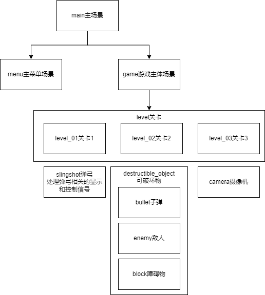
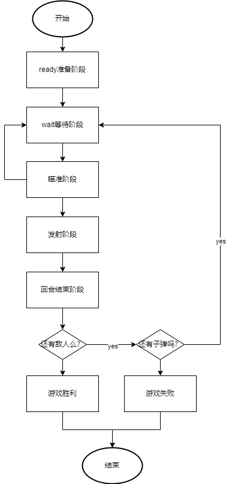
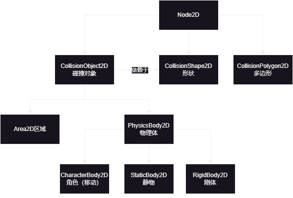

# GodotBounceMasters

老李godot教程demo第3部，一个展示2D物理模块的仿《愤怒的小鸟》项目。

这是一个使用 Godot 4.1.3 开发的仿《愤怒的小鸟》游戏项目。

这个开源项目旨在创建一个有趣、互动性强的游戏，同时也是一个 **学习和实践 Godot 游戏开发的绝佳机会** 。

本项目也 **适合作为此类游戏的初始版本** ，在此基础上进行开发。

## 特色

- **完全开源**：任何人都可以查看、学习和修改代码。
- **Godot 4.1.3**：使用最新版本的 Godot 引擎，体验最新的功能和优化。
- **教育性质**：适合对游戏开发感兴趣的初学者和中级开发者。

## 项目结构

依然采用godot基于节点设计节点树的方式开发本游戏项目。本作的教学内容包括：
- 在于game游戏主体部分实现的关卡切换
- 基于继承的关卡制作
- godot中的2D物理相关的内容，特别是刚体的使用等

## game游戏流程

## godot中的2D物理

## 如何参与

我们鼓励以任何形式的参与：

- **代码贡献**：提交 Pull Requests 来修复 bug 或添加新功能。
- **反馈和建议**：通过 Issues 提供反馈或新的想法。
- **文档编写**：帮助我们改进项目文档。

## 支持项目

如果你喜欢这个项目，欢迎通过以下方式支持：

- **关注 B站账号**：查看相关教程和项目进展。
- **加入知识星球**：参与更深入的讨论和学习。
- **请我喝杯咖啡**：通过支付宝支持项目维护。

## 联系方式

- B站账号：[玩物不丧志的老李](https://space.bilibili.com/8618918)
- 知识星球：[老李游戏学院](https://wx.zsxq.com/dweb2/index/group/28885154818841)

- 支付宝：也可以请我喝杯咖啡

## 许可证

本项目遵循 [MIT 许可证](LICENSE)。

---

感谢每一位对项目做出贡献的人！

